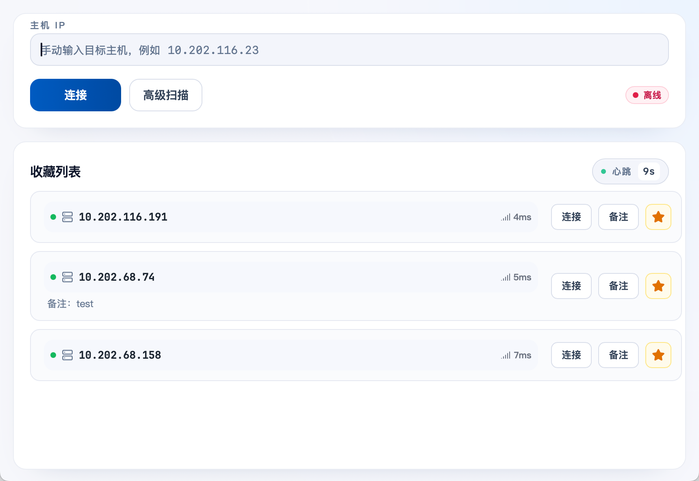
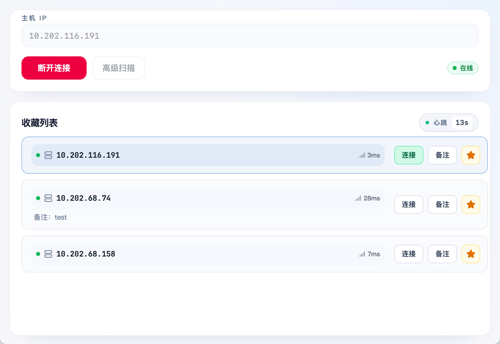
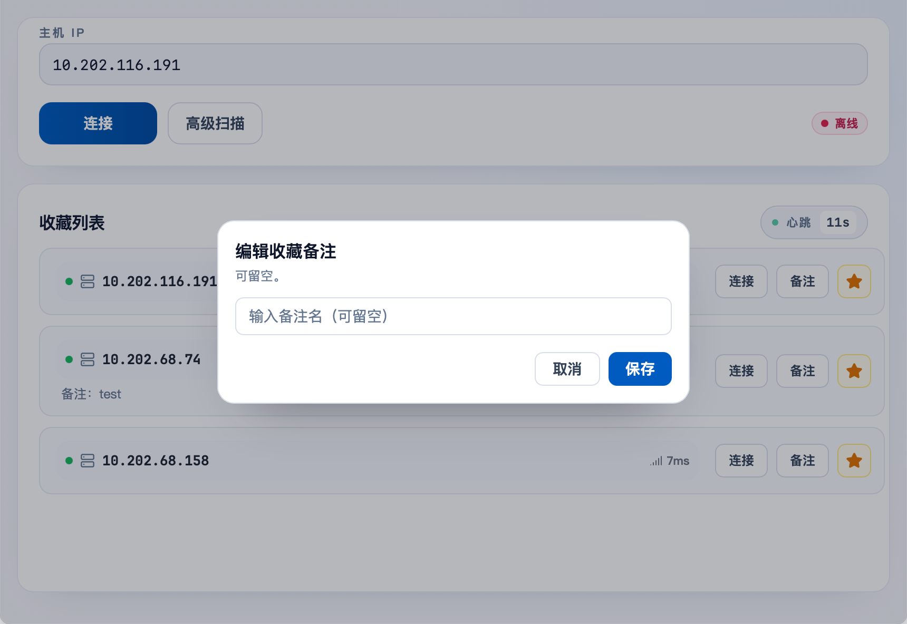

# LODOP Bridge Desktop 快速上手

## 先看这 30 秒：你该选哪种连接方式？

- **场景 A**：你已从同事那里拿到主机 IP（例如 `10.202.116.191`）→ 走“手动连接”。
- **场景 B**：你不知道谁的机器可用 → 走“高级扫描”，从局域网列表里选可用 IP。

连接前请确认两件事：

1. 对方电脑已启动 LODOP / C-Lodop 服务。
2. 你和对方在同一局域网（或同一 VPN 网段）。
3. 如果你要桥接“已连接打印机的同事电脑”，需要先向同事获取该电脑的 IP。



---

## 场景 A：已知同事 IP，手动连接

适用：你要桥接已连接打印机的同事电脑，且同事已经把该电脑 IP 发给你。

1. 打开客户端，在“主机 IP”输入框填入同事提供的 IP。
2. 点击“连接”。
3. 看到状态变为“在线”、按钮变为“断开连接”，表示连接成功。



---

## 场景 B：未知 IP，用高级扫描连接

适用：你不确定该连哪台机器，或希望从可用机器里挑一台延迟更低的。

### 第一步：打开扫描并等待结果

1. 在首页点击“高级扫描”。
2. 在侧栏点击“开始扫描”，等待扫描进度上涨。


### 第二步：从结果里选择目标 IP

1. 在扫描结果中找到可用主机（优先选延迟更低、状态稳定的）。
2. 点击对应主机右侧“选择”，系统会把 IP 带回首页。
3. 返回首页点击“连接”，连接成功后状态会变“在线”。


---

## 连接成功后，建议立刻做的一件事

- 在“收藏列表”里给常用机器加备注（如“张三-财务打印机”）。
- 下次可直接在收藏里点“连接”，不必再找 IP。



---

## 连接失败时，按这个顺序排查（高频）

1. **先确认对方服务在线**：让同事确认 LODOP / C-Lodop 是否正在运行。
2. **再确认网络可达**：你和对方是否同网段 / 同 VPN。
3. **再检查 IP 是否输错**：尤其注意末位数字。
4. **仍不行就走扫描**：改用“高级扫描”挑选可用 IP。
5. 当前客户端连接端口固定为 `8000`，无需手动修改。

---

## macOS 安装拦截处理（无签名 App）

若在其他 Mac 上首次打开被系统拦截，可在终端执行：

```bash
xattr -dr com.apple.quarantine "/Applications/LODOP Bridge.app"
```

若仍被拦截，再执行：

```bash
sudo xattr -dr com.apple.quarantine "/Applications/LODOP Bridge.app"
```

执行后重新打开应用即可。若安装目录不是 `/Applications`，请替换为实际 `.app` 路径。
